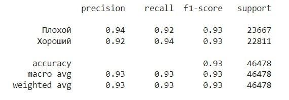
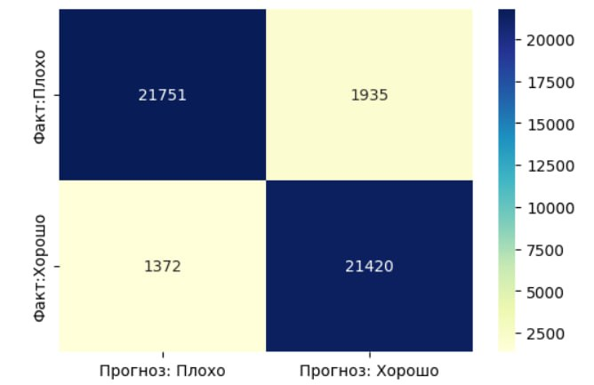

# Обнаружение фишинговых URL-адресов

## Над проектом работали:

```
Группа 9:
Смирнова А.
Кожедуб Н.
Багаудинов Э.
Петраков В.
```

# Web-приложение для обнаружение фишинговых URL-адресов
Web-приложение разделяет сайты на 2 категории:

```
Этот URL является безопасным
Этот URL является вредоносным
```
## Необходимо установить  библиотеки :
```python
pip install streamlit
pip install protobuf
pip install numpy
pip install pandas
pip install scikit-learn
pip install nltk
pip install pickle
pip install matplotlib
```

## Streamlit app
Приложение можно найти, щелкнув по значку Streamlit

[](https://smirnovaanastasia1234-final-hw-streamlit-sq0yb0.streamlit.app/)

## Метрики и оценки модели машинного обучения

* метрики и оценки модели машинного обучения
  


**визуализация


## Используемая литература
* [Ссылка на документацию streamlit](https://docs.streamlit.io/)
* [Ссылка на документацию scikit-learn](https://scikit-learn.org/)

